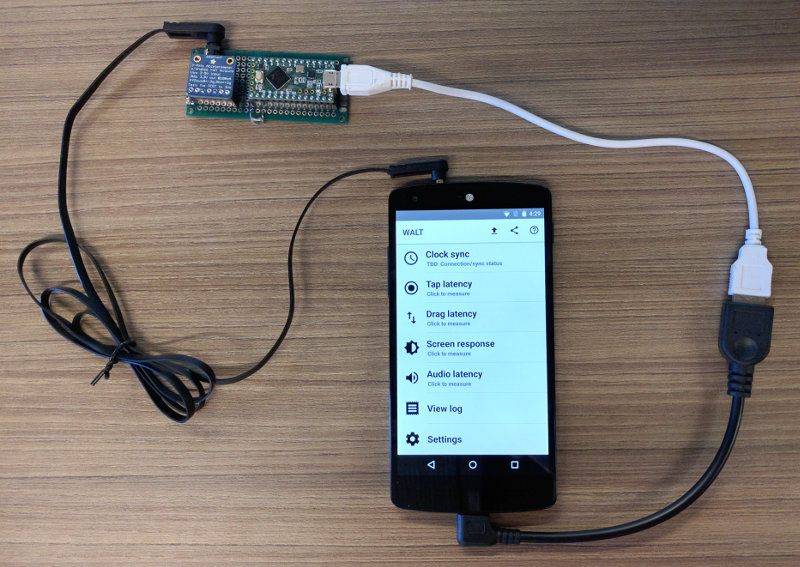

## WALT Latency Timer ##

**DISCLAIMER:** This is not an official Google product.

 * [Post about WALT on Android Developers Blog](http://android-developers.blogspot.ca/2016/04/a-new-method-to-measure-touch-and-audio.html)
 * [Instructional videos showing how to use WALT](https://www.youtube.com/playlist?list=PLd6Fi7WgXfcCEJg1FDqNCoQfpWo7W3J5a)

WALT is designed to measure the latency of physical sensors and outputs on phones and computers. It can currently perform the following measurements:

 * Tap latency - time from the moment a finger-like probe touches down (or up) on the screen
   until the kernel timestamps an ACTION_DOWN (or ACTION_UP) event. This physical contact with
   the screen is timed using an accelerometer mounted on the probe - [details](docs/TapLatency.md)
 * Drag latency (scroll) - [details](docs/DragLatency.md)
 * Screen draw latency - using a photodiode that detects whether the screen is black or white.
 * Audio output and microphone latencies - [details](docs/AudioLatency.md)
 * MIDI input and output latencies

WALT app for Android can be
[installed from Google Play](https://play.google.com/store/apps/details?id=org.kamrik.latency.walt)
or downloaded in the [releases section](https://github.com/google/walt/releases)

## Notes
* Hardware build instructions can be found in this repository under hardware/
* Clock synchronization details are described [here](android/WALT/app/src/main/jni/README.md)
* The Android device and Teensy clocks have a tendency to diverge due to
  differing clock frequencies. This means they will go out of sync after
  several minutes. The workaround is to use the app to re-sync the
  clocks. Some, but not all tests in the app will sync the clocks when starting a measurement.
* Python code used to communicate with WALT from Linux and ChromeOS can be found
  [here](https://chromium.googlesource.com/chromiumos/platform/touchbot/+/master/quickstep/)
